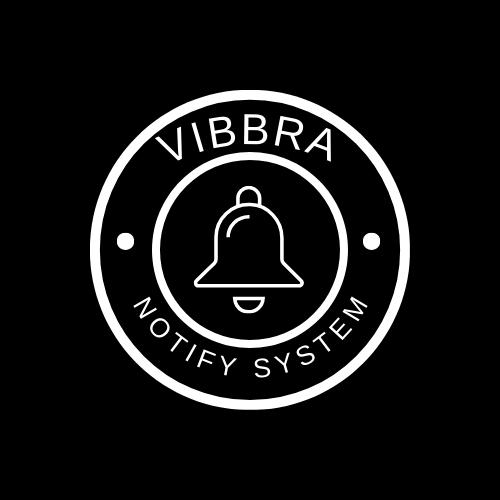

# vibbra-notify-system

<div align="center">

</div>

---

Sistema de Notificação de Mensagens em Python e Django

## Sobre o Projeto

Sistema de notificação de mensagens desenvolvido em Python com o Framework Django. Este projeto visa fornecer uma plataforma única para quem necessita integrar notificações em diversos canais, como Web Push, E-mail e SMS.
O público-alvo são profissionais de tecnologia que buscam uma solução centralizada para a gestão de notificações. Seja para enviar alertas, atualizações ou emails promocionais.

O projeto está disponível no link abaixo para ser testado:

- https://vibbra-notify-system.onrender.com/

## Tecnologias utilizadas

- [Python](https://www.python.org/) 3.11 como linguagem base
- [Django 5](https://www.djangoproject.com/) como framework de desenvolvimento de aplicações web
- [Gunicorn](https://gunicorn.org/) como servidor HTTP WSGI web
- [Whitenoise](https://pypi.org/project/whitenoise/) para servir arquivos estáticos
- [AWS S3](https://aws.amazon.com/pt/s3/) para armazenamento do upload de templates
- [PostgreSQL](https://www.postgresql.org/) como banco de dados de produção
- [Render](https://render.com/) como servidor de hospedagem

### Funcionalidades Principais

1. Tela de Configuração

- Permite ao usuário criar um aplicativo e definir os canais de notificação desejados (Web Push, E-mail, SMS).
- Configuração por canal (Web Push, E-mail, SMS) para personalização detalhada.

2. Tela de Setup Web Push

- Configuração de dados básicos como nome, endereço e ícone do site.
- Personalização de mensagens de permissão permitindo alterar texto da mensagem e dos botões permitir/negar.
- Configuração da notificação de boas vindas, permitindo a personalizando dos textos, títulos e links.

3. Tela de Setup E-mail

- Configuração de dados técnicos do servidor SMTP (nome, porta, login, senha).
- Definição de dados de envio (nome e e-mail do remetente).
- Submissão de templates de e-mail em formato HTML.

4. Tela de Setup SMS

- Configuração de provedor de SMS integrado (provedor, login, senha).

5. Tela de Histórico de Notificações

- Exibição do resumo das últimas notificações enviadas com filtros específicos (data, canal, origem).
- Possibilidade de exportar os dados para PDF e Excel.
- Visualização detalhada das informações de cada notificação contendo as informações: canal de envio, data e hora de envio e recebimento, confirmação de leitura, conteúdo da notificação (título, mensagem, link de direcionamento, conteúdo do e-mail).

6. Tela de Envio Manual de Notificações

- Interface para envio manual de notificações via Web Push, E-mail e SMS.
    - **Web Push**: Contém a audiência e dados da mensagem (título, texto da mensagem, ícone e link destino);
    - **SMS**: Telefone dos usuários e texto da mensagem;
    - **Email**: Email dos destinatários e templates existentes;
- Preenchimento de dados da mensagem e envio após confirmação.


## TODO

#### 1. Avaliação do Escopo e Reuniões de Alinhamento (**Subtotal: 15 horas**)
- [x] **Avaliação detalhada do escopo do projeto** (10 horas)
- [x] **Reuniões de alinhamento e esclarecimento de dúvidas** (5 horas)

#### 2. Configuração Inicial do Projeto (**Subtotal: 6 horas**)
- [x] **Configurar ambiente de desenvolvimento** (**Subtotal: 1 horas**)
  - [x] **Instalar Python e Django**
  - [x] **Configurar o Poetry para gerenciar dependências**
  - [x] **Configurar banco de dados (Postgres)**

- [x] **Criar estrutura básica do projeto Django** (**Subtotal: 2 horas**)
  - [x] **Criar novo projeto Django**
  - [x] **Configurar settings do projeto**
  - [x] **Criar aplicação principal do projeto**

- [x] **Implementar sistema de login e senha** (**Subtotal: 3 horas**)
  - [x] **Configurar autenticação padrão do Django**
  - [x] **Criar modelo de usuário personalizado**
  - [x] **Implementar views e templates de login e registro**
  - [x] **Implementar recuperação de senha**
  - [x] **Testes de funcionalidade de login e senha**

#### 3. Telas de Configuração (**Subtotal: 8 horas**)
- [x] **Criar interface de usuário para configuração** (2 horas)
- [x] **Implementar lógica para criação de aplicativos** (2 horas)
- [x] **Configuração de canais (Web Push, E-mail, SMS)** (2 horas)
- [x] **Validação e testes** (1 horas)

#### 4. Telas de Setup Web Push (**Subtotal: 9 horas**)
- [ ] **Desenvolver interface de usuário para setup de Web Push** (1 horas)
- [ ] **Configuração de dados básicos (nome, endereço, ícone)** (2 horas)
- [ ] **Implementar lógica para personalização de mensagens de permissão** (3 horas)
- [ ] **Implementar lógica para personalização de notificações de boas-vindas** (2 horas)
- [ ] **Validação e testes** (1 horas)

#### 5. Tela de Setup E-mail (**Subtotal: 10 horas**)
- [x] **Desenvolver interface de usuário para setup de E-mail** (1 horas)
- [x] **Configuração de dados técnicos do servidor SMTP** (2 horas)
- [x] **Implementar lógica para dados de envio (nome e e-mail do remetente)** (2 horas)
- [x] **Implementar submissão de templates de e-mail (upload e armazenamento)** (4 horas)
- [ ] **Validação e testes** (1 horas)

#### 6. Tela de Setup SMS (**Subtotal: 10 horas**)
- [ ] **Desenvolver interface de usuário para setup de SMS** (4 horas)
- [ ] **Configuração de provedor de SMS integrado (login, senha)** (4 horas)
- [ ] **Validação e testes** (2 horas)

#### 7. Tela de Histórico de Notificações (**Subtotal: 10 horas**)
- [x] **Desenvolver interface de usuário para histórico de notificações** (1 horas)
- [x] **Implementar filtros de busca (data, canal, origem)** (2 horas)
- [x] **Implementar exportação de dados para PDF e Excel** (4 horas)
- [x] **Implementar visualização detalhada de notificações** (2 horas)
- [ ] **Validação e testes** (1 horas)

#### 8. Tela de Envio Manual de Notificações (**Subtotal: 16 horas**)
- [x] **Desenvolver interface de usuário para envio manual (Web Push, E-mail, SMS)** (2 horas)
- [ ] **Implementar lógica de envio de Web Push** (6 horas)
- [x] **Implementar lógica de envio de E-mail** (1 horas)
- [ ] **Implementar lógica de envio de SMS** (6 horas)
- [ ] **Validação e testes** (1 horas)

#### 9. Deploy (**Subtotal: 10 horas**)
- [x] **Configuração do ambiente de produção** (**Subtotal: 3 horas**)
  - [x] **Configurar servidor Render** (2 horas)
  - [x] **Configurar banco de dados de produção** (1 horas)

- [x] **Configurar CI/CD** (**Subtotal: 7 horas**)
  - [x] **Configurar pipeline de CI/CD (GitLab CI)** (4 horas)
  - [x] **Testar e validar a pipeline de CI/CD** (3 horas)

### Total Geral
**Estimativa total: 94 horas**


## Estimativa em DIAS do prazo de entrega:
**Estimativa total: 30 dias**

## Como Rodar o projeto

Para rodar este projeto faça o clone deste repositório:

```
git clone https://git.vibbra.com.br/Miranda/notify-system.git
```

Você vai precisar ter o [Python](https://www.python.org/) instalado, e então utilize o "Pip" para instalar o "[Poetry](https://python-poetry.org/)":

```
python -m pip install poetry
```

Use os comandos abaixo para iniciar as instalação das dependências:

```
poetry install 
```

Após a instalação use os comandos abaixo para inicialização do Django (Esse projeto usa a lib [Taskpy](https://github.com/taskipy/taskipy), então os comandos abaixo nos ajudam a abstrair a iniciliazação do projeto):

**IMPORTANTE**: Antes de rodar o projeto confirme que todas as variáveis de ambiente estão configuradas. Altere o arquivo `.env.examples` para `.env` e preencha as variáveis.

```python

poetry run python src/manage.py makemigrations # verifica se existe migrations a serem criadas
poetry run python src/manage.py migrate --settings=setup.settings.local  # aplica as migrações pendentes
poetry run python src/manage.py runserver --settings=setup.settings.local  # inicia o projeto

# Usando Taskpy
poetry run task migration  # verifica se existe migrations a serem criadas e aplica as migrações pendentes
poetry run task runserver  # inicia o projeto

```

O argumento **--settings=setup.settings.local** é usado para facilitar a execução das ações em diferente ambientes, sendo:

- Base: Configuração comum entre todos os ambientes;
- Local: Configuração para execução local, usando banco de dados sqlite3 e outras features que ajudam no desenvolvimento: **--settings=setup.settings.local**
- Prod: Configuração para execução em produção, usando banco de dados Postgres e outras features de segurança para o ambiente de produção: **--settings=setup.settings.prod**

## Tests

Algumas funções fundamentais estão cobertas por testes, e eles podem ser executados usando os comandos abaixo:

```python
poetry run python src/manage.py test --settings=setup.settings.local

# Usando Taskpy
poetry run task test
```

O projeto também utiliza a lib [Ruff](https://pypi.org/project/ruff/) para fornecer Lint para padronização do código conforme as melhores especificações e PEP da linguagem:

```
poetry run task lint  # Mostra todos os pontos que estão fora da norma
poetry run task format  # Executa algumas correções automaticamente
```

## Vunerabilidades e Problemas conhecidos

- [ ] As senhas do servidor SMTP não estão criptografadas e estão expostas;
- [ ] O upload de template não realiza escape para tags perigosas como `<script>`;
